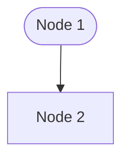

Title: pelican 에서 mermaid.js 입력할 수 있는 방법을 찾다
Date: 2024-10-19 12:50
Modified: 2024-10-19 12:50
Category: Operation
Tags: mermaid.js, python-markdown, pelican
Slug: pelican-에서-mermaidjs-입력할-수-있는-방법을-찾다
Summary: mermaid.js 로 작성된 그래프를 그리고 싶었는데, 방법을 찾다가 동작하는 내용을 확인하여 구성내용을 정리한다.


GitHub: [Lee-W/markdown-mermaidjs](https://github.com/Lee-W/markdown-mermaidjs)

```sh
uv add markdwon-mermaidjs
```

`pelicanconf.py` 파일에 다음 내용을 추가해준다.

```python
MARKDOWN = {
    "extension_configs": {
        ...
        "markdown_mermaidjs": {}
    },
    ...
}
```

그러면 다음과 같이 표현을 보여줄 수 있다. 따로 테마 설정없이 추가해줄 수 있다.


